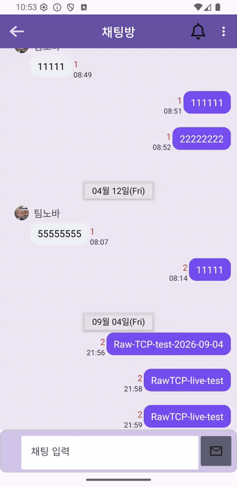

# OurBook — Server

웹소설 플랫폼 OurBook의 서버입니다. **PHP REST API**와, WebSocket 라이브러리 없이 직접 설계한 **Java Raw TCP 채팅 서버**로 이루어져 있습니다.

**클라이언트 저장소:** [ourbook-android](https://github.com/rookieko/ourbook-android)

| | |
|---|---|
| 역할 | 개인 프로젝트 (서버·클라이언트 전부 직접 구현) |
| 최초 개발 | 2023-12 ~ 2024-02 |
| 현재 상태 | **복구·정리 완료 (2026-09).** 실제 서버에서 동작을 재확인함 |
| 성격 | production-ready 서비스가 아니라 **복구·학습 프로젝트**입니다. 알려진 보안 부채가 남아 있고, 아래 회고에 그대로 적어 두었습니다 |

---

## 이 프로젝트에서 가장 볼 만한 것 — Raw TCP 채팅 서버

신입 포트폴리오에서 실시간 채팅은 대개 Socket.IO나 STOMP 같은 **라이브러리 위**에서 만듭니다. 이 프로젝트는 그 아래를 직접 짰습니다.

```text
프로토콜   개행으로 구분된 JSON (newline-delimited JSON)
전송       Raw TCP, 포트 6080
메서드     init · send · update_chat_id · refresh_chat_id
인증       접속 직후 JWT 검증. PHP REST 와 같은 HS256 대칭키를 공유한다
```

**설계에서 실제로 풀어야 했던 문제들**

- **메시지 경계(framing).** TCP는 스트림이라 `send` 한 번이 `recv` 한 번과 대응하지 않습니다. 개행 구분자를 프레임 경계로 정하고 `BufferedReader.readLine()` 으로 잘라 읽습니다
- **접속별 스레드와 브로드캐스트.** `ClientHandler` 가 소켓 하나를 맡고, `ChatRoom` 이 참여자 목록을 들고 있다가 같은 방의 다른 핸들러로 밀어 넣습니다
- **오프라인 폴백.** 소켓이 붙어 있지 않은 참여자에게는 FCM 푸시로 대신 보냅니다 (`FcmManager`)
- **읽음 동기화.** `update_chat_id` / `refresh_chat_id` 로 마지막 읽은 메시지 ID를 맞춥니다

DTO는 Android 쪽과 **의도적으로 복제**되어 있습니다. 공유 모듈을 두지 않은 대신 필드를 바꿀 때 양쪽을 같이 고쳐야 하는 부담을 졌습니다. 지금이라면 스키마를 한 곳에 두고 생성하는 쪽을 택하겠습니다.

---

## 구성

```text
common/        설정 (config.example.php 를 config.php 로 복사해 사용)
db-connect.php mysqli 연결
member/        회원 · 인증 · 프로필     (JWT 발급/검증, 이메일 인증)
webnovel/      작품 · 회차 · 리뷰 · 채팅방 · 탐색 · 검색
upload/        프로필/표지 이미지 (내용은 저장소에 포함하지 않음)
java/novel-talk/chat/   Java Raw TCP 채팅 서버
db/schema.sql  스키마 · 트리거 6개 · 프로시저
```

| 항목 | 수 | 산정 기준 |
|---|---|---|
| PHP 파일 | 57 | `vendor/` 제외 전체. 엔드포인트 외 설정·헬퍼 포함 |
| 채팅 Java 소스 | 28 | `novel-talk/chat/src/main` 아래 `.java` |
| DB 테이블 | 22 | `schema.sql` |
| 트리거 | 6 | 좋아요 점수·조회수·채팅방 인원 자동 갱신 |

---

## 실행 방법

비밀값은 저장소에 없습니다. **아래를 채우지 않으면 동작하지 않습니다.**

### 1. PHP API

```bash
cp common/config.example.php common/config.php
# DB_USERNAME · DB_PASSWORD · JWT_PUBLICKKEY 를 채운다
mysql -u <user> -p ourbook < db/schema.sql
```

`vendor/` 는 포함하지 않았습니다. JWT 라이브러리가 필요합니다 (`member/memberToken.php` 의 require 참조).

### 2. Java 채팅 서버

```bash
cd java/novel-talk/chat
mvn dependency:build-classpath -DincludeScope=runtime -Dmdep.outputFile=target/cp.txt
mvn package
java -cp "target/classes:$(cat target/cp.txt)" com.novel.SocketMain
```

**주의 두 가지 — 둘 다 실제로 겪은 함정입니다.**

- `pom.xml` 에 shade/assembly 플러그인이 없어 **plain jar 에는 의존성이 들어가지 않습니다.** classpath 에 의존성을 직접 넣어야 `LoggerFactory` 로딩에서 죽지 않습니다
- `FirebaseInitializer` 가 자격증명 파일을 **상대경로**로 엽니다. 원본은 웹 루트에서 실행하는 것을 전제했습니다. 이 저장소에서는 `GOOGLE_APPLICATION_CREDENTIALS` 환경변수로 바꿔 두었습니다. **Firebase 초기화 예외는 catch 되므로 소켓은 떠도 FCM만 조용히 죽어 있을 수 있습니다**

`JWT_PUBLICKKEY`(PHP)와 `TokenCheck.java` 의 키는 **같은 값이어야** 합니다. 다르면 REST 로그인은 되는데 채팅 접속만 거부됩니다.

---

## 리뷰·평점 — 다축 평가와 트리거 집계

채팅 다음으로 볼 만한 곳입니다. `webnovel/review/` 에 엔드포인트 6개가 있습니다.

| 파일 | 줄 | 하는 일 |
|---|---:|---|
| `regis-review.php` | 44 | 리뷰 등록 · 재평가 |
| `item-webnovel-comment.php` | 44 | 작품별 리뷰 목록 (정렬 옵션) |
| `regis-review-like.php` | 38 | 리뷰 좋아요 (= 댓글 평가) |
| `get-review-statics.php` | 37 | 축별 평점 통계 |
| `get-own-review.php` | 30 | 리뷰 단건 조회 |
| `get-best-review.php` | 23 | 베스트 리뷰 |

### `registerReview()` — 이 저장소의 트랜잭션 참조 구현

`webnovel/webnovelQuery.php:304`. 리뷰 하나를 등록하는 일이 **두 테이블에 걸쳐 있습니다.**
다섯 축 점수는 `novel_rating` 에 `type_id` 로 나뉘어 들어가고, 본문은 `comment` 로 갑니다.
둘 중 하나만 남으면 "점수는 있는데 글이 없는" 리뷰가 생깁니다.

- `begin_transaction()` 으로 묶고, 예외에서 `rollback()`
- 전 구간 prepared statement — `bind_param("iiid")` / `bind_param("iis")`
- 재평가는 `INSERT … ON DUPLICATE KEY UPDATE` 로 **덮어쓰기**. 중복 행이 쌓이지 않습니다

이 프로젝트의 다른 곳에는 문자열 연결로 만든 SQL 이 남아 있습니다(아래 *회고* 2번 참고).
그래서 **여기를 기준으로 삼고 나머지를 이쪽으로 옮기는 중**이라고 읽는 편이 정확합니다.

### 좋아요 집계는 애플리케이션이 아니라 트리거가 한다

`:531` `registerReviewLike()` / `:561` `unregisterReviewLike()` 는 `comment_rating` 에
`INSERT IGNORE` / `DELETE` 만 합니다. `comment.like_score` 의 증감은 **AFTER INSERT ·
AFTER DELETE 트리거**가 처리합니다. 앱이 집계를 직접 더하지 않으므로 동시 요청에도 어긋나지 않습니다.

`db/schema.sql` 에는 이런 트리거가 6개 있습니다. **다만 그중 채팅방 인원수 트리거는
앱 동작과 어긋나 있습니다** — 아래 *회고* 4번을 보십시오.

---

## 회고 — 스스로 찾아 고친 것

2026년에 이 프로젝트를 다시 열어 직접 감사하고 고쳤습니다. **결함을 숨기지 않고, 왜 여기까지만 했는지도 함께 적습니다.**

### 1. 작가 모드 3개 엔드포인트에 인가 검사가 없었다 (IDOR)

- **문제** — `webnovel-update.php`, `chapter-update.php`, `regist-chapter.php` 가 JWT로 *인증*만 하고 **작품 소유자인지 확인하지 않았습니다.** 로그인한 사용자면 누구나 `wid` 만 바꿔서 남의 작품을 수정·삭제할 수 있었습니다
- **확인 방법** — 세 파일의 쿼리에 `uid` 조건이 있는지 전수 확인
- **선택** — 공통 소유권 헬퍼 `isWebnovelOwner($wid, $uid)` 를 `webnovelQuery.php` 에 두고 세 엔드포인트 진입부에서 차단
- **검증** — `php -l` 통과, 세 파일 모두 헬퍼 호출 확인
- **남긴 한계** — 다른 엔드포인트의 인가는 이번 범위에 넣지 않았습니다

### 2. 문자열 연결로 만든 SQL

- **문제** — `chapter-update.php` 등이 요청 값을 문자열로 이어 붙여 쿼리를 만들었습니다
- **선택** — 해당 파일들을 prepared statement 로 이관하고, 삭제 시 `WHERE id = ? AND wid = ?` 로 범위를 좁힌 뒤 `affected_rows` 를 확인하고 나서야 회차 수를 감소시키도록 바꿨습니다
- **남긴 한계** — **전체 PHP 를 prepared statement 로 이관하지는 않았습니다.** 위험이 큰 곳부터 고치고 멈췄습니다

### 3. 비밀번호가 응답에 실려 나갔다

- **문제** — `getUserData()` 가 `SELECT *` 결과를 그대로 반환해 **평문 비밀번호가 회원 정보 응답에 포함**됐습니다
- **선택** — 반환 직전 `unset($row['password'])`
- **남긴 한계** — 근본 해결은 `SELECT` 컬럼 명시입니다. 주석으로 남겨 두었습니다

### 4. 트리거 설계가 앱 동작과 어긋난다 (미해결)

`after_user_exits_chat_room` 트리거는 `chat_room_user` 의 **하드 DELETE** 에 반응하는데, 앱은 `class` 컬럼을 바꾸는 **소프트 삭제**를 씁니다. 따라서 **채팅방 인원수가 줄어들지 않습니다.**

고치려면 트리거를 UPDATE 기반으로 바꾸거나 앱을 하드 삭제로 바꿔야 하는데, 어느 쪽이든 기존 데이터 정합성을 다시 봐야 해서 **이번에는 기록만 하고 두었습니다.**

### 알려진 보안 부채 (그대로 남아 있음)

| 항목 | 상태 |
|---|---|
| 비밀번호 평문 저장·평문 비교 | 미해결. 해시로 바꾸면 기존 계정이 전부 무효가 됨 |
| MariaDB 3307 포트 외부 노출 | 미해결. 토이 프로젝트 서버라 방치했고, 회고 자산으로 남김 |
| `error-show.php` 가 `display_errors` 를 켠다 | 미해결. 오류 노출 위험 |

---

## 이 저장소에 없는 것

- `common/config.php` — `config.example.php` 를 복사해 만드세요
- Firebase 서비스 계정 JSON
- `vendor/` (Composer 의존성)
- `upload/` 의 실제 사용자 이미지 — 개인정보라 제외했습니다

---

## 동작 실증 (2026-09-04)

실제 서버에 채팅 서버를 띄우고 Android 에뮬레이터에서 왕복을 확인했습니다.

```text
6080 LISTEN · java RSS 약 110MB (t2.micro 949MB 중)
앱에서 전송 → 서버 처리 → DB 저장(id 부여) → FCM 팬아웃까지 성공
```

클라이언트 로그에서 서버가 되돌려준 페이로드를 그대로 확인했습니다.

```json
{"chat_message":{"chat_room_id":6,"content":"RawTCP-live-test","id":396,
  "send_date":"2026-09-04 21:59:48","uid":22},
 "message":"서버에서 보내기 sendMethod 실행됨","method":"send"}
```

### 터미널을 두 번째 참여자로 세운 데모 (2026-09-07)

폰 두 대를 붙이면 "채팅이 된다"만 보입니다. **프로토콜을 직접 설계했다는 주장을 증명하려면
클라이언트가 앱이 아니어도 된다는 걸 보여야 합니다.**

그래서 두 번째 참여자를 터미널로 세웠습니다. `nc` 수준의 소켓 하나로 붙어
개행 JSON 을 한 줄씩 던지면, 앱이 그걸 그냥 받습니다.

```text
$ python3 tcp_client.py <server> 6080      # Raw TCP · 개행 구분 JSON

--> {"method":"init","jwt":"<마스킹>","fcm_token":"demo-terminal-client"}

--> {"method":"send","chat_message":{
       "chat_room_id":6,"chat_room_user_id":20,"username":"팀노바",
       "content":"터미널에서 보낸 Raw TCP 메시지",
       "new_date":1788746037242,"option":0}}

<-- {"method":"send","message":"서버에서 보내기 sendMethod 실행됨",
     "chat_message":{"id":397,"uid":40,"send_date":"2026-09-07 10:53:57"}}

<-- {"method":"refresh_chat_id","list_chat_room_user":[ … 참여자 3명, last_read_chat_id=397 ]}
```

던진 줄이 앱 화면에 뜨는 장면입니다. 앱은 다른 계정(`uid 22`)으로 로그인해 있어
터미널이 보낸 메시지를 **상대방 말풍선**으로 그립니다.



`send` 한 번에 서버가 하는 일이 응답에 다 드러납니다 — DB 에 저장하며 `id` 를 부여하고(397),
방 참여자 전원에게 브로드캐스트하고, 이어서 `refresh_chat_id` 로 각자의 읽음 위치를 갱신합니다.

**띄울 때 실제로 걸린 함정** — `~/.m2` 에 guava 16.0.1 이 함께 있어 classpath 앞쪽에 잡히면
Firebase 가 `NoSuchMethodError: MoreExecutors.directExecutor()` 로 죽습니다
(`directExecutor` 는 guava 18부터). **소켓은 정상적으로 뜨고 FCM 만 죽기 때문에 놓치기 쉽습니다.**
